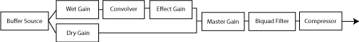
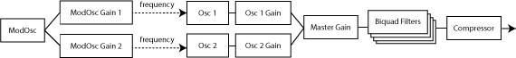
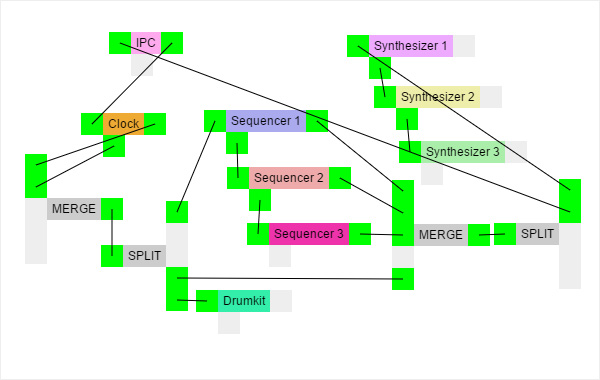

# Socket Synchronized Sound-Machine

SSSM is a websocket and webaudioAPI based Electron Application. Its purpose is to share the joy of creating rythm and sound together with others. The Electron App itself working as the audio generating source and can run a webserver, providing the user-interface to control different parameters of the soundmachine. The Soundmachine contains the following instruments: 

- step-sequencing drumkit
- polyphonic synthesizer (2 Osc, 2 ADSR Envelopes Amp & Filter, ModOsc)
- midi-sequencer  
- harmonic keyboard

The internal communication is midi-based, therefore it is possible to connect external devices. The Electron App itself provides a interface to easily connect virtual and physical instruments by IN, OUT and THROUGH connectors. Additional Split and Merge Nodes expand the variety of possible connection schemes.

## Prerequisites

Node JS & NPM

## Installation

```bash 
//Clone the repository
git clone git@gitlab.iue.fh-kiel.de:ctag/sssm.git
cd ./sssm

//Install dependencies
npm install 

//Start Electron
npm start
```
The sound files can be downloaded [here](https://1drv.ms/u/s!AmcxqJSwsH0ueNdOsX3Dx2qmqoo), simply extract to the "app" folder.


## Instruments 

### Drumkit
The Drumkit was the entry point for this project and is based on the Shiny Drum Machine by Chris Rogers and Ken Moore (offline by now :/ ).
Its been rebuild to a 16 step audio-sample based step-sequencer, with an external clock, that is used application wide via midi signals. Its sound files are asynchronously loaded and decoded to work as audio buffer for the source node. For Effects, impulse response audio files are loaded and decoded to work as a convolver node. Whole Setup:




### Synthesizer
The Synthesizer contains of 2 Oscillators with four curve shapes (Sine, Cube, Saw, Triangle), each connected to a modulating LFO, Amp and Filter. Both Filter and Amp use Envelopes to control Attack, Sustain, Decay and Release. Whole Setup:




### Sequencer
The Sequencer is triggered by a clock signal ('F2') and emits Key-On ('9') and Key-Off ('8') midi signals on different steps. The amount of steps is variable between 1 and 16 blocks of 16 steps (256 total).  

### Harmonic Keyboard
The harmonic keyboard is a little extra feature to play notes in a scale. You can set it to minor or majore combined with a key note and an octave.   


## Communication

### Midi Controller
Every instrument got its own Midi-Handler, binding HEX values from midi-data to update functions or parameters. To be fed with midi data, every instrument get its own  midi-controller - a piece of middleware, with two inputs (IN and THROUGH) and one output (OUT). It sole purpose is to filter by channel and transfer data between endpoints.

### Websocket
Websockets are used to transfer midi signals and system data from the server to clients or listening servers in the same network. There are some special events for sequencer updates, because midi signals are a bit too smallsized sometimes. The websocket engine used is socket.io.

### IPC
Electrons IPC Module (Inter Process Communication) is the bridge between the application frontend and backend. Because every Instrument is running in the Rendered Window, the Midi Signals have to be transferred to the Backend via IPC. Its Output is then connected to the Server, which emits to the clients via websocket. 

### External Devices
The SSSMachine is capable of using Midi-Devices via WebMidi. A midi-controller is assigned to every external device found.


## Client

### Midi-Markup
The client-side user-interface uses a markup attributes to bind midi information to buttons and sliders, to keep it simple and extendable. There are two main Input-Types 
'slider--x' and 'button' usable by the 'sssm-input=TYPE' attribute, both bindable to midi-control bytes by adding the 'midi-cc=HEX' attributes. For more complex RPN signals you can use 
'midi-cc="63"' combined with midi-msb="HEX" and midi-lsb="HEX". On receiving new midi-signals, the ui elements midi-value="INT" attribute and slider position gets updated.

#### Example
```html
    <div class="panel">
        <h2>Filter</h2>

        // New X-Slider for Midi Control Change Message 30
        <div sssm-input="slider--x" midi-cc="30">Freqency</div>
                                   
        // New Select for Midi Control Change Message 32
        <select id="filterSelect" sssm-input="select" midi-cc="32" name=""></select>  

        // New Button for Midi NRPM Controller (CC 0x63) with MSB 0x05 and LSB 0x51 
        <input type="button" class="button" sssm-input="button"  midi-cc="63"  midi-msb="05" midi-lsb="51">
 
    </div>
```

### Midi Circuiting
To simulate an analogue midi cable system, the SSSMachine UI is rendering a canvas Element to connect each of the midi-controllers. It uses Konva as a Framework to easily manage events and object groups. Additional Split and Merge Nodes expand the variety of possible connection schemes. 

##### Example


